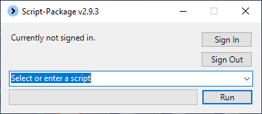

# Script-Package

## Requirements

**[Powershell 7 or higher](https://learn.microsoft.com/en-us/powershell/scripting/install/installing-powershell?view=powershell-7.4)**  

**Run as administrator:** The installer version will create a shortcut which can be ran as admin. You can set it to always run as admin by going to the shortcut's properties, then "Advanced", then checking off "Run as administrator".  
For the portable version, run `Script-Package.bat` as administrator.

**Modules:** Microsoft.Graph, ExchangeOnlineManagement  
- `Install-Module -Name Microsoft.Graph -Force -AllowClobber`  
- `Install-Module -Name ExchangeOnlineManagement -Force -AllowClobber`  
  
There is an option in the dropdown called `Install-RequiredModules`, if you run this then the two commands shown above will be run.

## The GUI

What it looks like:  
  

**Sign In Status:** When first opening the GUI this will usually say "Currently not signed in.". After using the sign in button to login it will change to say which account you are currently logged in with.

**Sign In Button:** Use this to sign into Microsoft Graph and ExchangeOnline. You should make sure to do this before running any scripts that use either Graph, Exchange or both. You can find specifically which scripts require signing in in the [scripts](#scripts) section below.  

**Sign Out Button:** Use this to sign out of Microsoft Graph and ExchangeOnline so that you can then sign in with another company's credentials.  

**Script Select:** You can either choose a script from the dropdown or type out the name of a script manually into this box.  

**Run Button:** Click this to run the selected script. If the name entered is invalid or if it's left blank then this button will do nothing.  

**Progress Bar:** Shows progress for running tasks when buttons are clicked or scripts are run.

## Scripts

### Add-Contacts

*Requires sign in.*  
Add contacts for Microsoft 365.

### Add-DistributionListMember

*Requires sign in.*  
Add a single member or multiple members to a distribution list.

### Add-EmailAlias

*Requires sign in.*  
Add an alias to an email.   
Also has options for adding aliases in bulk.

### Add-MailboxMember

*Requires sign in.*  
Add a member to another mailbox. It can be a shared mailbox or just another user's email.  
Also has options for adding members in bulk.  
Also has buttons for adding only SendAs, SendOnBehalf or FullAccess permissions (FullAccess is also known as ReadAndManage).

### Add-TrustedSender

*Requires sign in.*  
Adds an email address or domain to the trusted senders list for all mailboxes in the current tenant. This will take a while to complete (especially in a big tenant) since all the mailboxes are having their junk email settings configured.

### Add-UnifiedGroupMember

*Requires sign in.*  
Add a single or multiple members to a Unified/Office365 Group.  

### Add-2FA

*Requires sign in.*  
Add a phone number to an email for 2FA.  
Also has options for bulk. 

### Block-User

*Requires sign in. Requires run on server with Active Directory.*  
For AD: This will disable the AD account of the entered user.  
For O365: This will disable the account, convert the mailbox to type shared,  change the password to something random, remove all licenses and remove any 2FA number associated with the account. Has options for adding members to the shared mailbox and for adding an auto-reply.  
Bulk options will be added in the future.

### Clear-RecycleBin

Empties all recycle bins on the computer. For a terminal server, this would mean deleting the contents of everyone's recycle bins.

### Convert-O365GroupToDistributionList

*Requires sign in.*  
Creates a new distribution list using the members of an existing Office365 group.  
Has an input field for an email address of a Microsoft365 Group. The script will create a new distribution list, get all the members of the M365 group and then add them to the newly created distribution list. The name of the new distribution list will be the first part of the email entered with "-New" tacked on.  
Also includes a tab for converting M365 groups in bulk.   
If you want to change the names/addresses of the newly created distribution list(s) or if you want to delete the old M365 group(s) you will need to do it manually from the Office365 admin web portal.

### Enable-Archive

*Requires sign in.*  
Turn on archiving, jumpstart archiving or turn on auto-expanding archive for a mailbox.  

### Install-RequiredModules

Installs required modules for the script package to work.  
`Install-Module -Name Microsoft.Graph -Force -AllowClobber`  
`Install-Module -Name ExchangeOnlineManagement -Force -AllowClobber`

### New-ADAccounts

*Requires run on server with Active Directory.*  
Add Active Directory accounts in bulk.  
The script will auto-detect the ActiveDirectory domain/forest name, but it can be changed if necessary.

### New-ADAndEmailAccounts

*Requires sign in. Requires run on server with Active Directory.*  
The script will auto-detect the ActiveDirectory domain/forest name, but it can be changed if necessary.  
The email domain to use for the new email accounts must be entered or the email accounts won't be created.  
Choose a license for the new email account from the list and make sure to purchase enough licenses before running the script or none will be assigned.  

### New-EmailAccounts
*Requires sign in.*  
Use the button to open and fill out the template.  
Choose a license for the new email account from the list and make sure to purchase enough licenses before running the script or none will be assigned.  

### Remove-DistributionListMember

*Requires sign in.*  
Remove a single member or multiple members from a distribution list.

### Remove-MailboxMember

*Requires sign in.*  
Remove a member from another mailbox. It can be a shared mailbox or just another user's email.  
Also has options for removing members in bulk.  
Also has buttons for removing only SendAs, SendOnBehalf or FullAccess permissions (FullAccess is also known as ReadAndManage).

### Remove-UnifiedGroupMember

*Requires sign in.*  
Removes a single or multiple members from a Unified/Office365 group.

### Update-ScriptPackage

Attempts to update the script package if a newer version is available.  

### Set-ACLPermissions

A tool for dealing with ACL permissions.  
Has bulk options.

### Set-NTP

A tool for checking the time server and configuration of the current computer/server. Can set it to time.windows.com.

### Show-Information

Script-Package info and links.

## Logging

Most of the scripts will create a transcript in the `Logs` folder.  
The transcripts are set to overwrite older ones, so if you run a scipt twice you will only see the log for the latest run.
